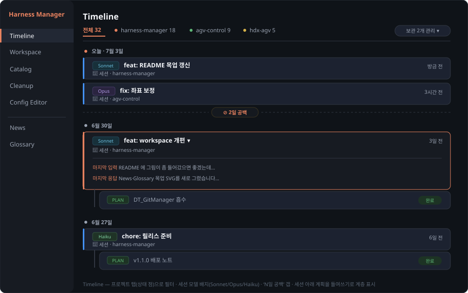
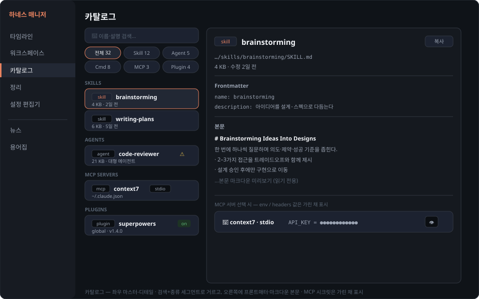
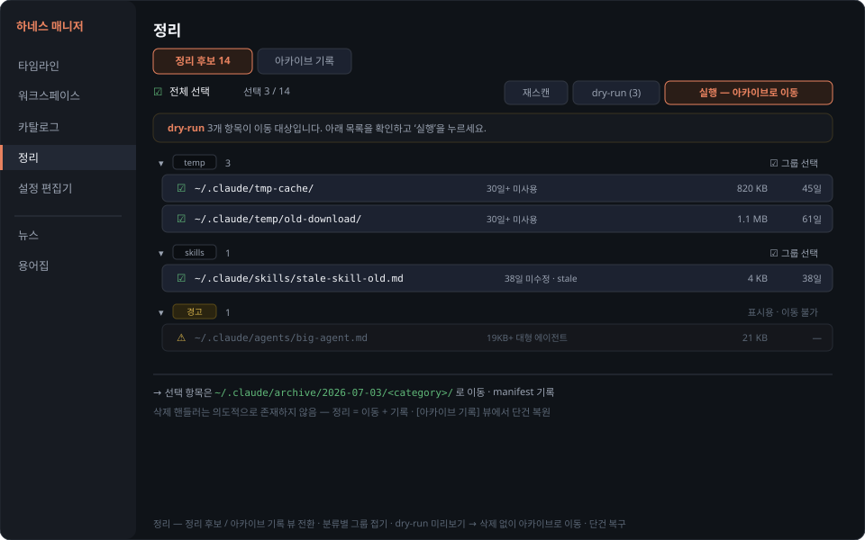
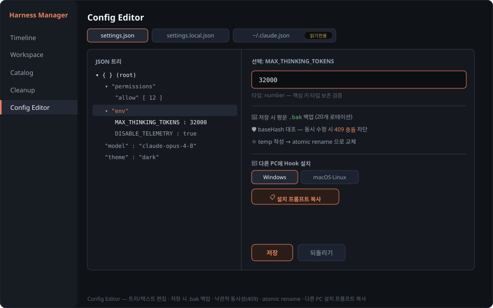

<p align="center">
  
</p>

<p align="center">
  
  
  
  
  
  
  
</p>

Claude Code의 전역 환경(`~/.claude` 디렉토리 + `~/.claude.json`)을 한 화면에서 조회·편집·정리하는 **로컬 전용 데스크톱 앱**(Electron).

- 스킬·에이전트·커맨드·플러그인·**MCP 서버**를 블럭으로 보고, 클릭하면 본문/설정까지 펼쳐 본다.
- `settings.json`을 **JSON 트리 에디터**로 안전하게 편집한다.
- 오래된 프로젝트·임시 파일을 **삭제 없이 아카이브로** 정리하고 되돌린다.
- 여러 프로젝트의 최근 작업·계획·세션을 **작업 회상 대시보드(Workspace)** 로 모아 보고, **프로젝트별 git 작업**(상태·diff·커밋·브랜치·그래프·merge/rebase·push/pull)까지 그 자리에서 처리한다.

네트워크 포트를 열지 않고(렌더러↔백엔드는 Electron IPC), 환경 파일 연산은 `~/.claude` 경로 안에서만, git 작업은 `git rev-parse`로 검증된 저장소 경로에서만 일어난다(모두 로컬 CLI 호출, 외부로 노출되지 않는다). 받는 사람은 **각자 자기 PC**에서 실행해 **자기 `~/.claude`**를 관리한다(데이터는 공유되지 않는다).

## 미리보기

<p align="center"></p>

<p align="center"><em>Workspace 디테일에서 <code>[Git]</code> 모드 — 변경/커밋/그래프/브랜치를 그 자리에서.</em></p>

<p align="center"></p>

<p align="center"><em><code>[개요]</code> 모드 — 자동 회상 · 메모 · 트랙/할 일 · 계획 · 메모리 브라우저.</em></p>

### 탭 둘러보기

<table>
  <tr>
    <td width="50%"><br><sub><b>Timeline</b> — 날짜별 세션·계획과 “N일 공백” 구분선</sub></td>
    <td width="50%"><br><sub><b>Catalog</b> — 카드 블럭·인라인 확장·시크릿 마스킹</sub></td>
  </tr>
  <tr>
    <td width="50%"><br><sub><b>Cleanup</b> — 삭제 없이 아카이브로 이동·복구</sub></td>
    <td width="50%"><br><sub><b>Config Editor</b> — 트리 편집·자동 백업·충돌 방지</sub></td>
  </tr>
</table>

## 빠른 시작

**Windows**

1. [Releases](https://github.com/rafaam11/claude-harness-manager/releases)에서 **`Claude-Harness-Manager-Setup-x.y.z.exe`** 를 내려받아 실행한다.
2. 서명되지 않은 빌드라 Windows SmartScreen 경고가 뜰 수 있다 — **추가 정보 → 실행**으로 진행한다.
3. 설치 후 바탕화면/시작 메뉴의 **Claude Harness Manager** 로 실행한다.

**Linux (AppImage)**

1. [Releases](https://github.com/rafaam11/claude-harness-manager/releases)에서 아키텍처에 맞는 AppImage를 내려받는다 — x64는 **`...-x64.AppImage`**, aarch64(Jetson·라즈베리파이4+ 등)는 **`...-arm64.AppImage`**.
2. 실행 권한을 부여한다: `chmod +x Claude-Harness-Manager-*.AppImage`.
3. 더블클릭하거나 터미널에서 실행한다.

**Node.js 설치는 필요 없다**(Electron에 런타임이 내장됨).

## 업데이트 (자동)

이 저장소는 **public**이라 앱이 새 버전을 **자동으로** 받는다. 실행 중·"업데이트 확인" 시 GitHub 릴리스를 조회해 새 버전이 있으면 **배경에서 차등 다운로드**(NSIS·AppImage 모두 blockmap delta)하고, 완료되면 사이드바 좌측 하단 버튼이 **"재시작하여 적용"** 으로 바뀐다. 누르면 **인스톨러 창 없이 무음으로 설치하고 앱이 자동 재실행**되며 갈아끼운다(앱을 그냥 종료해도 다음 실행에 적용됨). 자동 확인이 실패하면 같은 자리에 **릴리스 페이지 열기** 링크가 떠 수동 설치로 대체할 수 있다.

> 각 플랫폼·아키텍처의 **첫 릴리스는 1회 수동 설치/다운로드**가 필요하다 — Windows는 v1.0.0(이전 v0.4.0 이하엔 자동 업데이트 기능이 없었음), Linux x64·arm64는 갈아끼울 기존 설치본이 없기 때문. 이후부터는 위 절차로 자동 갱신된다.

## 주요 기능

- **Catalog** — Skill / Agent / Command / MCP Server / Plugin을 종류별 블럭으로. 클릭 시 인라인 상세(프론트매터·마크다운 본문·연결 설정).
- **MCP 조회** — `~/.claude.json`의 mcpServers를 읽어 표시. 시크릿(env/headers)은 기본 마스킹 + 토글.
- **Config Editor** — `settings.json`을 트리/텍스트 모드로 편집. 저장 시 자동 백업·충돌 감지.
- **Cleanup** — 규칙 기반 스캔 → dry-run → 아카이브 이동(삭제 없음) → 복구.
- **Timeline** — 날짜별 세션/계획 이벤트를 "N일 공백" 구분선과 함께. 기본 진입 탭.
- **Workspace** — 프로젝트 회상(좌우 마스터-디테일) + 상태/메모/트랙 + 계획 + **메모리/파일 브라우저**(옛 Memory 탭 흡수). 프로젝트 목록은 정렬·숨기기로 정돈한다.
- **Git (Workspace 내장)** — 변경/diff/stage/commit, 커밋 그래프(DAG), 브랜치 전환·생성, merge/rebase/cherry-pick/revert, push/pull/fetch. 시스템 `git` CLI 직접 호출(GitHub 연동은 후속).
- **News** — Claude Code 릴리스 노트·Anthropic 공식 소식·AI 뉴스(Hacker News)를 한 피드로 모아 본다. **English / 한국어 / 병기** 전환 + DeepL 번역(코드·명령어·고유명사는 영어 유지). 라이브 fetch도 번역도 main이 처리한다(렌더러는 외부 호출 없음).
- **Glossary (용어집)** — 바이브코딩·AI 용어를 **3단계 분류 트리**(좌우 마스터-디테일)로 학습한다. 최근 프롬프트를 **로컬 분석**해 ❌ 내가 쓴 막연한 표현 / ✅ 정식 용어로 명확히 쓴 예시를 짚어주는 **추천 어휘**, 자주 헷갈리는 **약점 영역** 안내, Claude Code로 채우는 **커스텀 용어집**(로보틱스·비전 등 개인 도메인), 그리고 용어 간 연결을 자동 추출해 옵시디언처럼 시각화하는 **관계 그래프(Graph View)** 를 지원한다. 외부 호출 없음.
- **안전 모델** — 경로 allowlist, git 저장소 검증 가드, 낙관적 동시성(409), `.bak` 백업, 아카이브 복구.

## 사용법

좌측 네비게이션에서 관리 5탭(Timeline · Workspace · Catalog · Cleanup · Config Editor)과 그 아래 구분된 **News · Glossary** 탭으로 이동한다. 기본 진입은 **Timeline**이다. 우상단 **☀ / 🌙** 로 라이트/다크 테마를 전환한다(localStorage에 저장). 업데이트 확인 버튼은 사이드바 맨 아래에 고정돼 있다.

### Timeline
날짜별로 **세션·계획 이벤트**를 시간순으로 보여준다(기본 진입 탭). 같은 세션에서 만든 계획은 그 세션 행 아래 **들여쓰기된 자식**으로 묶여 위계가 드러난다(설치된 hook이 있으면 확정 연결, 없으면 시간 근접으로 추정). 주말 같은 공백은 "N일 공백" 구분선으로 가시화된다. 행을 클릭하면 펼쳐서 세션은 마지막 입력/응답 스니펫을, 계획은 본문 마크다운을 보여준다. Claude Code 세션이 실행 중이면 상단에 경고 배너가 뜬다(설정 저장·정리 시 충돌 주의).

### Workspace
"어디까지 했는지" 회상하고 **그 프로젝트에서 바로 git 작업**까지 잇는 좌우 2단 화면이다.

- **왼쪽(마스터)** — 최근 활동순 프로젝트 카드 목록 + 맨 아래 미연결 계획.
- **오른쪽(디테일)** — 선택한 프로젝트 상세. 상단의 **`[개요]` / `[Git]`** 탭으로 전환한다.
  - **개요** — 자동 회상(AI 제목·마지막 입력/응답), 상태·메모, 접이식 **트랙/할 일** 체크리스트, 그 프로젝트의 **계획 목록**(클릭하면 본문 펼침), 접이식 **메모리/파일 브라우저**(`memory` 기본·"전체 파일" 토글로 열람 — 옛 Memory 탭을 흡수).
  - **Git** — 디테일 영역 전체가 git 워크벤치로 바뀐다. 좌측 **Changes / History** 탭(변경 파일 + 커밋 박스 / 커밋 그래프), 우측 diff·커밋 상세, 상단 바의 브랜치 전환과 Fetch/Pull/Push. 커밋 우클릭으로 checkout·merge·rebase·cherry-pick·revert. 저장소를 자동으로 못 찾으면 **폴더 선택**으로 지정한다.

### Catalog
종류별 섹션(**Skills / Agents / Commands / MCP Servers / Plugins**)으로 나뉘며, 각 항목은 카드 블럭이다. 카드를 클릭하면 그 자리에서 상세가 펼쳐진다(한 번에 하나). **모두 읽기 전용**이다.

- **Skill / Agent / Command** — 경로·크기·수정일 + **프론트매터 표** + **마크다운으로 렌더된 본문**. 19KB를 넘는 에이전트는 ⚠ 표시.
- **MCP Servers** — 연결 설정(stdio: `command`/`args`/`env`, http/sse: `url`/`headers`). **`env`·`headers` 값은 `••••`로 가려지고 👁 를 누르면 노출**된다.
- **Plugins** — 활성 상태(enabled / disabled / project / blocked) + 설치 스코프·버전.

### Cleanup
오래된 데이터를 **삭제하지 않고** 아카이브로 옮긴다.

1. **재스캔** — 정리 후보를 규칙으로 찾는다(임시 디렉토리 30일+, stale 프로젝트, 대형 에이전트는 경고용).
2. 옮길 항목을 체크하고 **dry-run** 으로 "무엇이 어디로 가는지" 먼저 확인한다.
3. **실행 — 아카이브로 이동** — `~/.claude/archive/<날짜>/<category>/` 로 이동하고 manifest에 기록한다.
4. 아래 manifest 목록에서 **복원** 으로 원위치 되돌린다.

> 대형 에이전트 경고(`warn-only`)는 표시용이므로 이동 대상이 아니다.

### Config Editor
`settings.json` / `settings.local.json` 을 **JSON 트리 에디터**(vanilla-jsoneditor)로 편집한다.

- 상단 메뉴바에서 **tree / text / table 모드** 를 전환한다.
- **저장** 시 현재본을 `.bak` 로 백업(20개 로테이션)한 뒤 원자적으로 교체한다. 파일이 외부에서 바뀌면 충돌(409)을 감지해 덮어쓰지 않는다.
- 하단 **백업** 목록에서 이전 버전으로 **복원**한다.
- **`.claude.json` 은 읽기 전용** 이다(Claude Code가 상시 재작성하므로 충돌을 막기 위함 — 수동 절차로만 수정).
- 이 PC에 **세션-계획 연결 hook**이 설치돼 있으면 하단에 **다른 PC 설치 프롬프트 복사** 패널이 뜬다. Windows/macOS·Linux를 고르고 복사해 다른 PC의 Claude Code에 붙여넣으면 훅 설치를 대신 맡길 수 있다.

### News
Claude Code 릴리스 노트 · Anthropic 공식 소식 · 일반 AI 뉴스(Hacker News)를 시각 역순으로 모은 통합 피드다. main이 공개 소스를 **라이브 fetch**하고(렌더러는 외부 호출 없음), 항목을 클릭하면 펼쳐서 Claude Code 패치 노트는 본문 마크다운을, 그 외는 "원문 열기"로 OS 브라우저를 연다. 수동 새로고침 위주이며 마지막 결과를 디스크에 캐시한다.

- **언어 전환** — 상단 **EN / 한국어 / EN+한(병기)** 토글. 한국어·병기 모드는 **DeepL Free API**로 번역하되 **코드·명령어·URL·고유명사(Claude · Anthropic · MCP 등)는 영어 그대로** 유지한다(마스킹 보강). 번역은 필요할 때만 호출하고 캐시해 무료 한도를 아낀다(English 모드는 호출 0).
- **DeepL 키** — 한국어·병기를 처음 고르면 키 입력란이 뜬다(무료 키는 `…:fx` 로 끝남 → free 엔드포인트 자동 선택). 키는 `~/.claude/harness-manager/secrets.json` 에만 보관되고 화면에선 마스킹되며, 렌더러로는 "설정됨 여부"만 전달된다.

### Glossary
바이브코딩·AI·개발 용어를 **대분류 > 소분류 > 용어** 3단계 트리로 학습하는 좌우 2단 사전이다. 모든 분석은 로컬에서만 일어난다(외부 호출 없음).

- **트리 탐색** — 왼쪽에 4개 대분류(화면 UI · AI 활용 · 개발 기초 · 도구·협업) 아래 9개 소분류, 오른쪽에 선택한 소분류의 용어가 분류 경로(breadcrumb)와 함께 펼쳐진다. UI 요소는 미니 SVG 스케치를 곁들인다. 검색은 트리를 가로질러 전체에서 찾는다.
- **추천 어휘(do/don't)** — 내가 Claude Code에 입력한 최근 프롬프트를 **로컬 분석**해, 막연한 표현(예: "팝업")만 쓰고 정식 명칭("Modal")은 안 쓴 용어를 우선 추천한다. 카드에 **❌ 내가 실제로 쓴 문장 / ✅ 정식 용어로 명확히 쓴 예시**를 나란히 보여줘 습관을 교정하고, 자주 헷갈리는 **약점 영역**도 짚어준다.
- **커스텀 용어집(개인화)** — 로보틱스·비전처럼 사람마다 다른 도메인은 좌측 **＋ 내 용어집** 패널의 프롬프트를 복사해 자기 Claude Code에 붙여넣으면, CC가 `~/.claude/harness-manager/glossary-custom.json` 을 채운다. 앱은 이 파일을 **읽기 전용**으로 읽어 사용자 정의 도메인을 트리에 더한다(손상·없음에도 생존).
- **관계 그래프(Graph View)** — 용어 정의 본문에 등장하는 다른 용어의 영문 명칭을 **자동 추출**해 연결을 만든다(예: Modal↔Popover, Frontend↔Backend). 트리/그래프 뷰를 전환하면 옵시디언처럼 전체 용어를 노드로 시각화하고(분류색·전역/로컬 그래프), 노드를 끌면 연결된 이웃이 함께 딸려온다. 휠 확대/축소·드래그 이동·표시 설정 슬라이더(간격·중력·글자/노드 크기)를 지원하며, 모든 행에는 클릭하면 이동하는 **관련 용어** 칩이 붙는다. 새 의존성·외부 호출 없이 SVG로 직접 구현했다.

## 아키텍처

<p align="center"></p>

renderer는 실제 경로를 모른 채 요청(또는 projectId)만 보내고, main의 경량 `router`가 받아 services/lib로 위임한다. 모든 변경은 안전 모델(path-guard · lock · safe-write · archive · git repo-guard)을 통과한다. 내부 구조·규약은 [CLAUDE.md](CLAUDE.md) 참조.

## 안전장치

- 모든 환경 파일 연산은 `~/.claude` + `~/.claude.json` 경로 allowlist 내에서만 (path-guard, 위반 시 403).
- git 작업은 별도 가드 — `git rev-parse --show-toplevel`로 검증한 저장소 경로에서만 실행하고, 렌더러는 경로 대신 projectId만 보낸다(main이 해석·검증).
- 쓰기: baseHash 대조(불일치 409) → 구조 검증 → 평문 `.bak` 백업(20개 로테이션) → atomic rename.
- 정리: 삭제 없음 — 항상 archive로 move + manifest/journal 기록, 단건 복구 지원.
- 조회 전용(카탈로그 본문·MCP)도 경로·읽기 전용 정책을 그대로 통과한다.
- 네트워크 포트 미개방 — renderer↔main은 Electron IPC(`window.api.invoke`). 단일 인스턴스 락으로 중복 실행 차단.
- `.claude.json`은 읽기 전용(Claude Code가 상시 재작성 — 수동 절차로만 수정).

## 개발

단일 Electron 프로젝트(electron-vite). 모든 명령은 루트에서 실행한다.

```bash
git clone https://github.com/rafaam11/claude-harness-manager.git
cd claude-harness-manager
npm install
npm run dev        # electron-vite dev (main/preload/renderer HMR + Electron 창)
```

| 스크립트 | 설명 |
|---|---|
| `npm run dev` | electron-vite 개발 모드 |
| `npm run build` | typecheck + 프로덕션 번들(`out/`) |
| `npm run typecheck` | TypeScript 타입 검사(node + web 2패스) |
| `npm run icon` | `build/icon.ico`·`icon.png` 재생성 |
| `npm run dist` | Windows 설치본 빌드 → `release/`에 setup.exe 생성(로컬) |
| `npm run dist:linux` | Linux AppImage 빌드 → `release/`에 AppImage 생성(로컬, Linux/WSL 필요) |

- 린트 도구·단위 테스트 프레임워크는 없다. 변경 검증의 1차 관문은 `npm run typecheck`, 2차는 `npm run build`.
- 릴리스: `package.json` 버전 bump 후 **`v*` 태그를 푸시**하면 GitHub Actions CI(`.github/workflows/release.yml`)가 ubuntu(x64·arm64)·windows 매트릭스로 빌드해 같은 태그의 **draft 릴리스에 자산을 append**한다(OS/아키텍처별 설치본 + `latest*.yml` + `*.blockmap` 자동 생성). 사람이 GitHub에서 검토 후 **수동 publish**한다. 로컬 검증·수동 업로드 fallback은 `npm run dist`(Windows)·`npm run dist:linux`(Linux) + `gh release upload`.
- 코드 구조·규약은 [CLAUDE.md](CLAUDE.md) 참조.
