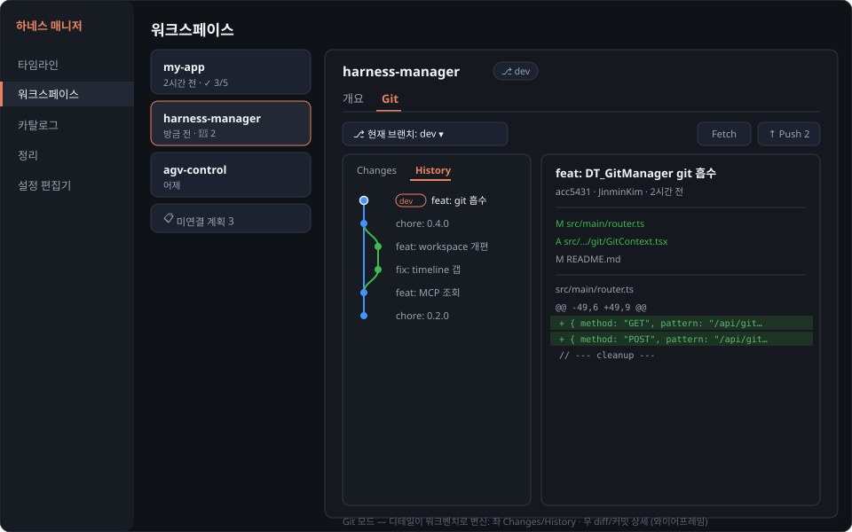
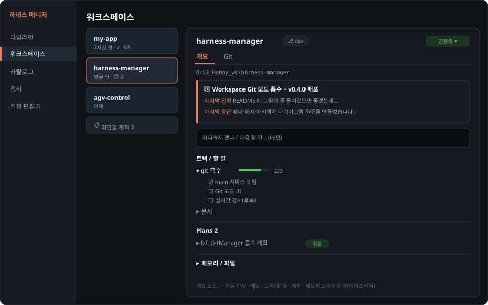
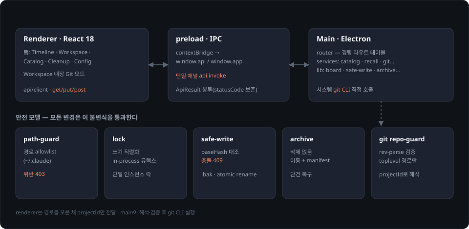

<p align="center">
  
</p>

<p align="center">
  
  
  
  
  
  
</p>

Claude Code의 전역 환경(`~/.claude` 디렉토리 + `~/.claude.json`)을 한 화면에서 조회·편집·정리하는 **로컬 전용 데스크톱 앱**(Electron).

- 스킬·에이전트·커맨드·플러그인·**MCP 서버**를 블럭으로 보고, 클릭하면 본문/설정까지 펼쳐 본다.
- `settings.json`을 **JSON 트리 에디터**로 안전하게 편집한다.
- 오래된 프로젝트·임시 파일을 **삭제 없이 아카이브로** 정리하고 되돌린다.
- 여러 프로젝트의 최근 작업·계획·세션을 **작업 회상 대시보드(Workspace)** 로 모아 보고, **프로젝트별 git 작업**(상태·diff·커밋·브랜치·그래프·merge/rebase·push/pull)까지 그 자리에서 처리한다.

네트워크 포트를 열지 않고(렌더러↔백엔드는 Electron IPC), 환경 파일 연산은 `~/.claude` 경로 안에서만, git 작업은 `git rev-parse`로 검증된 저장소 경로에서만 일어난다(모두 로컬 CLI 호출, 외부로 노출되지 않는다). 받는 사람은 **각자 자기 PC**에서 실행해 **자기 `~/.claude`**를 관리한다(데이터는 공유되지 않는다).

## 미리보기

<p align="center"></p>

<p align="center"><em>Workspace 디테일에서 <code>[Git]</code> 모드 — 변경/커밋/그래프/브랜치를 그 자리에서.</em></p>

<p align="center"></p>

<p align="center"><em><code>[개요]</code> 모드 — 자동 회상 · 메모 · 트랙/할 일 · 계획 · 메모리 브라우저.</em></p>

## 빠른 시작 (Windows)

1. [Releases](https://github.com/digitrack-inc/claude-harness-manager/releases)에서 **`Claude Harness Manager Setup x.y.z.exe`** 를 내려받아 실행한다.
2. 서명되지 않은 빌드라 Windows SmartScreen 경고가 뜰 수 있다 — **추가 정보 → 실행**으로 진행한다.
3. 설치 후 바탕화면/시작 메뉴의 **Claude Harness Manager** 로 실행한다. **Node.js 설치는 필요 없다**(Electron에 런타임이 내장됨).

## 업데이트 (수동)

이 저장소는 **비공개**라 앱이 자동으로 업데이트를 받지는 않는다. 대신 사이드바 좌측 하단 버전 배지 옆 **"새 버전 확인"** 버튼을 누르면 GitHub 릴리스 페이지가 브라우저로 열린다(GitHub에 로그인돼 있어야 보인다). 거기서 최신 **`Claude Harness Manager Setup x.y.z.exe`** 를 받아 실행하면 기존 설치 위에 **덮어쓰기 설치**된다.

## 주요 기능

- **Catalog** — Skill / Agent / Command / MCP Server / Plugin을 종류별 블럭으로. 클릭 시 인라인 상세(프론트매터·마크다운 본문·연결 설정).
- **MCP 조회** — `~/.claude.json`의 mcpServers를 읽어 표시. 시크릿(env/headers)은 기본 마스킹 + 토글.
- **Config Editor** — `settings.json`을 트리/텍스트 모드로 편집. 저장 시 자동 백업·충돌 감지.
- **Cleanup** — 규칙 기반 스캔 → dry-run → 아카이브 이동(삭제 없음) → 복구.
- **Timeline** — 날짜별 세션/계획 이벤트를 "N일 공백" 구분선과 함께. 기본 진입 탭.
- **Workspace** — 프로젝트 회상(좌우 마스터-디테일) + 상태/메모/트랙 + 계획 + **메모리/파일 브라우저**(옛 Memory 탭 흡수).
- **Git (Workspace 내장)** — 변경/diff/stage/commit, 커밋 그래프(DAG), 브랜치 전환·생성, merge/rebase/cherry-pick/revert, push/pull/fetch. 시스템 `git` CLI 직접 호출(GitHub 연동은 후속).
- **안전 모델** — 경로 allowlist, git 저장소 검증 가드, 낙관적 동시성(409), `.bak` 백업, 아카이브 복구.

## 사용법

좌측 네비게이션의 **5개 탭**(Timeline · Workspace · Catalog · Cleanup · Config Editor)으로 이동한다. 기본 진입은 **Timeline**이다. 우상단 **☀ / 🌙** 로 라이트/다크 테마를 전환한다(localStorage에 저장).

### Timeline
날짜별로 **세션·계획 이벤트**를 시간순으로 보여준다(기본 진입 탭). 주말 같은 공백은 "N일 공백" 구분선으로 가시화된다. 행을 클릭하면 펼쳐서 세션은 마지막 입력/응답 스니펫을, 계획은 본문 마크다운을 보여준다. Claude Code 세션이 실행 중이면 상단에 경고 배너가 뜬다(설정 저장·정리 시 충돌 주의).

### Workspace
"어디까지 했는지" 회상하고 **그 프로젝트에서 바로 git 작업**까지 잇는 좌우 2단 화면이다.

- **왼쪽(마스터)** — 최근 활동순 프로젝트 카드 목록 + 맨 아래 미연결 계획.
- **오른쪽(디테일)** — 선택한 프로젝트 상세. 상단의 **`[개요]` / `[Git]`** 탭으로 전환한다.
  - **개요** — 자동 회상(AI 제목·마지막 입력/응답), 상태·메모, 접이식 **트랙/할 일** 체크리스트, 그 프로젝트의 **계획 목록**(클릭하면 본문 펼침), 접이식 **메모리/파일 브라우저**(`memory` 기본·"전체 파일" 토글로 열람 — 옛 Memory 탭을 흡수).
  - **Git** — 디테일 영역 전체가 git 워크벤치로 바뀐다. 좌측 **Changes / History** 탭(변경 파일 + 커밋 박스 / 커밋 그래프), 우측 diff·커밋 상세, 상단 바의 브랜치 전환과 Fetch/Pull/Push. 커밋 우클릭으로 checkout·merge·rebase·cherry-pick·revert. 저장소를 자동으로 못 찾으면 **폴더 선택**으로 지정한다.

### Catalog
종류별 섹션(**Skills / Agents / Commands / MCP Servers / Plugins**)으로 나뉘며, 각 항목은 카드 블럭이다. 카드를 클릭하면 그 자리에서 상세가 펼쳐진다(한 번에 하나). **모두 읽기 전용**이다.

- **Skill / Agent / Command** — 경로·크기·수정일 + **프론트매터 표** + **마크다운으로 렌더된 본문**. 19KB를 넘는 에이전트는 ⚠ 표시.
- **MCP Servers** — 연결 설정(stdio: `command`/`args`/`env`, http/sse: `url`/`headers`). **`env`·`headers` 값은 `••••`로 가려지고 👁 를 누르면 노출**된다.
- **Plugins** — 활성 상태(enabled / disabled / project / blocked) + 설치 스코프·버전.

### Cleanup
오래된 데이터를 **삭제하지 않고** 아카이브로 옮긴다.

1. **재스캔** — 정리 후보를 규칙으로 찾는다(임시 디렉토리 30일+, stale 프로젝트, 대형 에이전트는 경고용).
2. 옮길 항목을 체크하고 **dry-run** 으로 "무엇이 어디로 가는지" 먼저 확인한다.
3. **실행 — 아카이브로 이동** — `~/.claude/archive/<날짜>/<category>/` 로 이동하고 manifest에 기록한다.
4. 아래 manifest 목록에서 **복원** 으로 원위치 되돌린다.

> 대형 에이전트 경고(`warn-only`)는 표시용이므로 이동 대상이 아니다.

### Config Editor
`settings.json` / `settings.local.json` 을 **JSON 트리 에디터**(vanilla-jsoneditor)로 편집한다.

- 상단 메뉴바에서 **tree / text / table 모드** 를 전환한다.
- **저장** 시 현재본을 `.bak` 로 백업(20개 로테이션)한 뒤 원자적으로 교체한다. 파일이 외부에서 바뀌면 충돌(409)을 감지해 덮어쓰지 않는다.
- 하단 **백업** 목록에서 이전 버전으로 **복원**한다.
- **`.claude.json` 은 읽기 전용** 이다(Claude Code가 상시 재작성하므로 충돌을 막기 위함 — 수동 절차로만 수정).

## 아키텍처

<p align="center"></p>

renderer는 실제 경로를 모른 채 요청(또는 projectId)만 보내고, main의 경량 `router`가 받아 services/lib로 위임한다. 모든 변경은 안전 모델(path-guard · lock · safe-write · archive · git repo-guard)을 통과한다. 내부 구조·규약은 [CLAUDE.md](CLAUDE.md) 참조.

## 안전장치

- 모든 환경 파일 연산은 `~/.claude` + `~/.claude.json` 경로 allowlist 내에서만 (path-guard, 위반 시 403).
- git 작업은 별도 가드 — `git rev-parse --show-toplevel`로 검증한 저장소 경로에서만 실행하고, 렌더러는 경로 대신 projectId만 보낸다(main이 해석·검증).
- 쓰기: baseHash 대조(불일치 409) → 구조 검증 → 평문 `.bak` 백업(20개 로테이션) → atomic rename.
- 정리: 삭제 없음 — 항상 archive로 move + manifest/journal 기록, 단건 복구 지원.
- 조회 전용(카탈로그 본문·MCP)도 경로·읽기 전용 정책을 그대로 통과한다.
- 네트워크 포트 미개방 — renderer↔main은 Electron IPC(`window.api.invoke`). 단일 인스턴스 락으로 중복 실행 차단.
- `.claude.json`은 읽기 전용(Claude Code가 상시 재작성 — 수동 절차로만 수정).

## 개발

단일 Electron 프로젝트(electron-vite). 모든 명령은 루트에서 실행한다.

```bash
git clone https://github.com/digitrack-inc/claude-harness-manager.git
cd claude-harness-manager
npm install
npm run dev        # electron-vite dev (main/preload/renderer HMR + Electron 창)
```

| 스크립트 | 설명 |
|---|---|
| `npm run dev` | electron-vite 개발 모드 |
| `npm run build` | typecheck + 프로덕션 번들(`out/`) |
| `npm run typecheck` | TypeScript 타입 검사(node + web 2패스) |
| `npm run icon` | `build/icon.ico`·`icon.png` 재생성 |
| `npm run dist` | Windows 설치본 빌드 → `release/`에 setup.exe 생성(로컬) |

- 린트 도구·단위 테스트 프레임워크는 없다. 변경 검증의 1차 관문은 `npm run typecheck`, 2차는 `npm run build`.
- 릴리스: `package.json` 버전 bump → `npm run dist` → `release/Claude Harness Manager Setup x.y.z.exe` 생성 → GitHub 릴리스에 **수동 업로드**(웹 드래그앤드롭 또는 `gh release create vX.Y.Z "release/Claude Harness Manager Setup X.Y.Z.exe"`).
- 코드 구조·규약은 [CLAUDE.md](CLAUDE.md) 참조.
